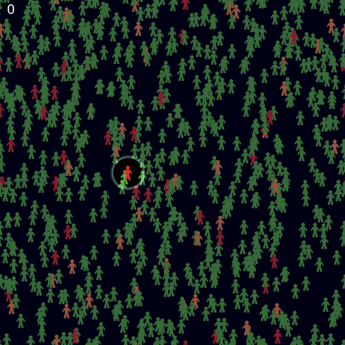
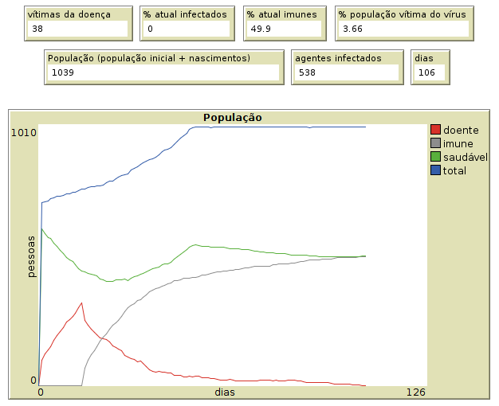
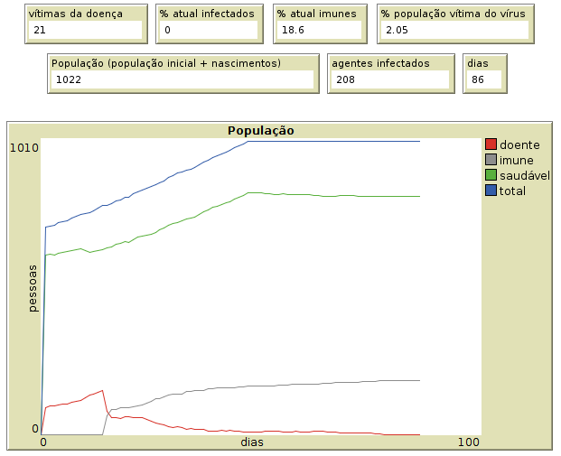

E se tentássemos simular o comportamento do vírus utilizando um sistema multiagentes? Essa pergunta passou pela minha cabeça em uma das noites de quarentena. Foi por isso que eu resolvi utilizar o [NetLogo](http://ccl.northwestern.edu/netlogo/), um ambiente de simulação que permite o desenvolvimento de modelos multiagentes, para simular a transmissão do novo coronavírus e mostrar como as ações recomendadas pela Organização Mundial de Saúde (OMS) são importantes para diminuir o contágio dele.

Antes de continuarmos, é importante deixar claro que a simulação não tem pretensões de prever o quantitativo de óbitos que serão causadas pela doença . O objetivo principal é demonstrar o comportamento do vírus e seus efeitos em diferentes cenários num mundo restrito composto inicialmente por 700 agentes . Ressalta-se que certas informações não foram levadas em consideração no experimento, como a sobrecarga de unidades de saúde, comorbidades ou idade dos infectados, fatores que podem agravar o combate à doença. 

O modelo desenvolvido foi baseado no *[Virus](https://ccl.northwestern.edu/netlogo/models/Virus)*, um modelo para simulação de transmissão de doenças virais, que está disponível na biblioteca do NetLogo. Nele foram realizadas as seguintes alterações:

* **Imunidade**: [A duração da imunidade do vírus Sars-CoV-2 ainda é objeto de estudo](https://www.bbc.com/portuguese/internacional-52462544), mas nessa simulação foi utilizado que o agente infectado pelo vírus desenvolvem imunidade para o resto da vida. 

* **Assintomáticos**: O modelo Virus não faz distinção em doentes com sintomas e sem sintomas, no modelo o agente só possui três estados: saudável, doente e imune. Para representar melhor a situação do coronavírus foi adicionado a possibilidade de um agente doente ser assintomático. Nesse sentido, ao contrair a doença o agente tem 50% de chance de ser assintomático. 

* **Movimentação no Ambiente**: No modelo inicial a movimentação de todos os agentes acontecem sem nenhuma restrição. Na modelagem foi colocada uma nova variável chamada social-isolation. Isso faz com que apenas parte da população se mova no ambiente a cada iteração. Além disso, os agentes doentes que apresentam sintomas só se movimentam no ambiente nos primeiros dias da doença.  

* **Infecção no ambiente**: A posição do ambiente (patch) pode alojar o vírus, caso um agente infectado o transmita quando estiver nela. Nesse caso, o vírus só fica alojado na posição por um curto espaço de tempo. 

Os agentes possuem cores que distinguem seu estado no ambiente. O vermelho e laranja representam os doentes sintomáticos e assintomáticos, respectivamente. Os verdes são os saudáveis e os cinzas, os imunes. Na animação abaixo é apresentada um trecho da simulação de um dos cenários (Cenário 1). O agente que está em foco inicia a simulação com o vírus mas se cura e consequentemente se torna imune. 

A interface da simulação possui variáveis que podem ser modificadas pelo usuário para analisar o comportamento da transmissão do vírus, também estão presentes monitores e gráficos que facilitam a visualização dos resultados. Na figura abaixo é apresentada a área de atualização de variáveis e a tela na qual a simulação ocorre. 

Foram definidos três cenários para analisar o comportamento da transmissão do vírus no ambiente. Os cenários testados foram os seguintes: 

* Cenário 1 - A doença já está presente no ambiente mas os agentes não diminuem a interação social e nem usam outras estratégias para mitigar a transmissão do vírus. Nesse cenário a infecciosidade é o valor máximo e o isolamento social não existe.
* Cenário 2 - A taxa de isolamento social é modificada para 48% e a taxa de infecciosidade é diminuída para [16% devido ao uso de máscaras](https://www.cnbc.com/2020/05/19/coronavirus-wearing-a-mask-can-reduce-transmission-by-75percent-new-study-claims.html). 
* Cenário 3 - A taxa de infecciosidade é mantida em 16% e a [taxa de isolamento é modificada para 75%](https://agenciabrasil.ebc.com.br/saude/noticia/2020-05/taxa-de-isolamento-social-em-sao-paulo-se-mantem-abaixo-dos-55). 

Em todos os cenários o [tempo de duração da doença foi configurado como 14 dias](https://www.bbc.com/portuguese/geral-52274791), o valor máximo de agentes no ambiente foi configurado como 1000 e a variável que indica a chance de se recuperar (chance-recovery) foi 93%. O valor da variável da taxa de infecciosidade (infectiousness) foi inicialmente 66%, mas esse valor foi alterado para 16% quando simulado o uso de máscaras pela população.

Como resultados foram obtidos os valores da quantidade de vítimas, dias para acabar os casos de infecção do vírus, quantidade de infectados, total de população que viveu no ambiente, além da porcentagem de vítimas da doença e a porcentagem de imunes ao término da simulação. A média de 30 simulações desses valores estão apresentados na tabela abaixo: 

|          -          | Cenário 1 | Cenário 2 | Cenário 3 |
|---------------------|-----------|-----------|-----------|
| Vítimas             | 66,07     | 36,8      | 20        |
| % atual imunes      | 89,35     | 50,36     | 25,94     |
| População           | 1066,03   | 1041      | 1023,7    |
| % população vítima  | 6,18      | 3,53      | 1,95      |
| Infectados          | 960,7     | 545,77    | 280,53    |
| Dias de Transmissão | 145,7     | 116,9     | 98,33     |
|                     |           |           |           |

O Cenário 1 foi o que sua população teve a maior exposição ao vírus, isso é possível ser evidenciado pela porcentagem da população que se tornou imune ao fim da simulação. Consequentemente esse cenário obteve a maior quantidade de vítimas. A quantidade de dias de transmissão também foi o maior dentre os cenários e isso aconteceu porque a transmissão só ficou controlada quando mais de 70% da população se tornou imune. Uma característica que foi visualizada é que nesse cenário houve um momento no primeiro mês que praticamente toda a população foi infectada em um curto espaço de tempo - situação que seria catastrófica no mundo real. Na figura abaixo é apresentado os resultados de uma das simulações utilizando o Cenário 1.

No Cenário 2 existe também um aumento da infecção no primeiro mês, quando a maioria ainda é saudável, mas a curva é muito mais achatada do que a apresentada no cenário anterior. Visualizando os números obtidos nesse cenário é possível perceber que o  impacto do vírus na população diminuiu quase que pela metade, isso foi devido ao isolamento social e a diminuição da taxa de infecciosidade do vírus. Na figura abaixo é apresentado o resultado de uma simulação utilizando o Cenário 2.

Dentre os cenários analisados nesta simulação, o Cenário 3 obteve os melhores resultados para o controle da transmissão do vírus. Todas as variáveis analisadas foram menores quando se aumentou o isolamento social e diminuiu a taxa de infecciosidade da doença. Na figura abaixo é apresentado o resultado de uma das simulações utilizando o Cenário 3.

Os resultados obtidos nos cenários utilizados neste experimento evidenciam que, assim como indicado pela comunidade científica mundial, a melhor forma de combater o vírus atual é se protegendo. No experimento o impacto do vírus foi muito menor quando a população dos agentes diminuiu a interação social e usou meios para diminuir a taxa de infecciosidade do vírus. Isso ratifica a importância seguir as recomendações da OMS de utilizar máscaras, higienizar as mãos com frequência e restringir ao máximo a interação social. 

Uma versão web do modelo pode ser acessada em https://rodrigoclira.github.io/netlogo-covid19.html , nela apenas os cenários apresentados estão habilitados. 

