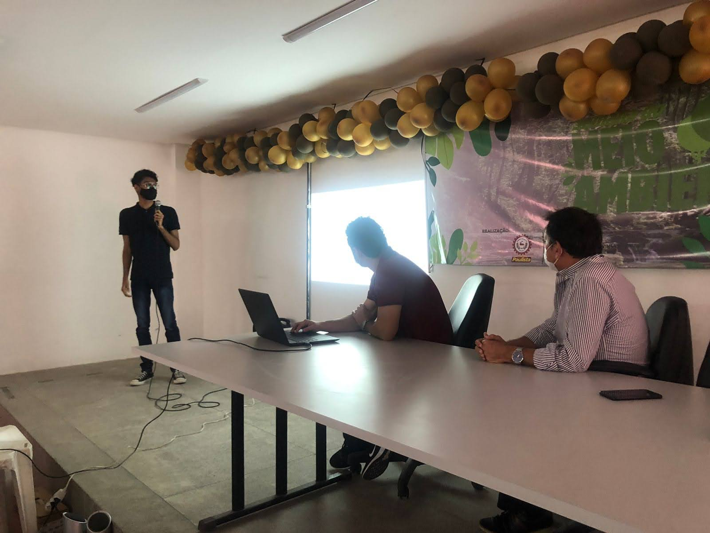
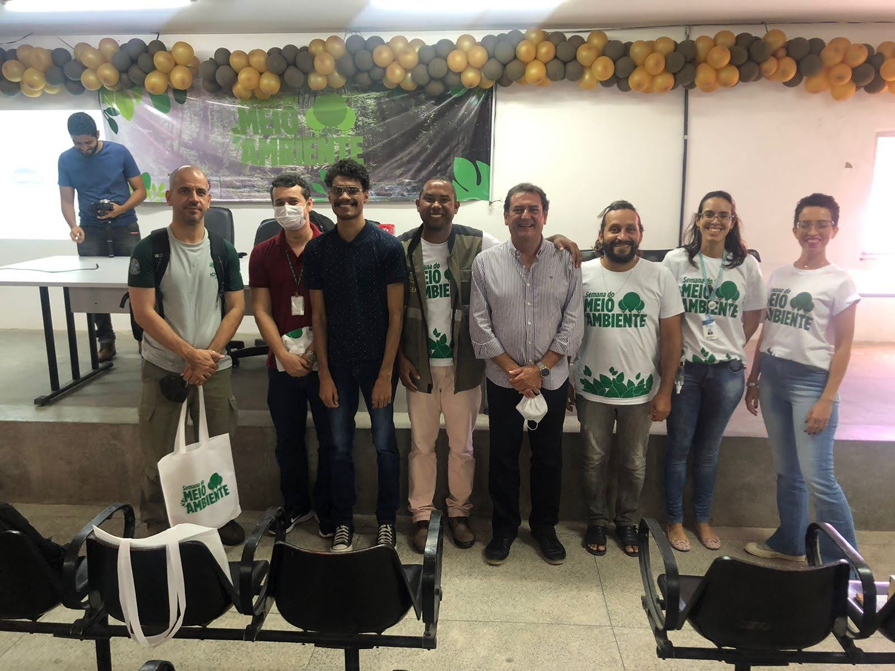
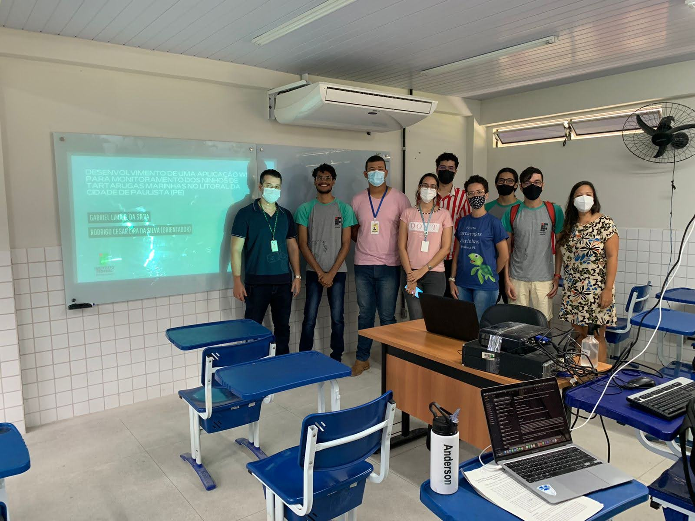

A primeira defesa de Trabalho de Conclusão de Curso de Análise e Desenvolvimento e Sistema aconteceu julho e nela foi apresentada um aplicativo desenvolvido pelo aluno Gabriel Lima para ser uma ferramenta de apoio para os servidores do  Nucleo de Sustentabilidade Urbana (NSU) da Prefeitura de Paulista no trabalho de preservação e monitoramento dos ninhos de tartarugas marinha no litoral da cidade.

Anteriormente, o foi apresentado na Semana do Meio Ambiente da cidade que aconteceu no dia 28 de junho.

## Semana do Meio Ambiente da Cidade de Paulista

 

## Defesa de Trabalho de Conclusão de Curso

