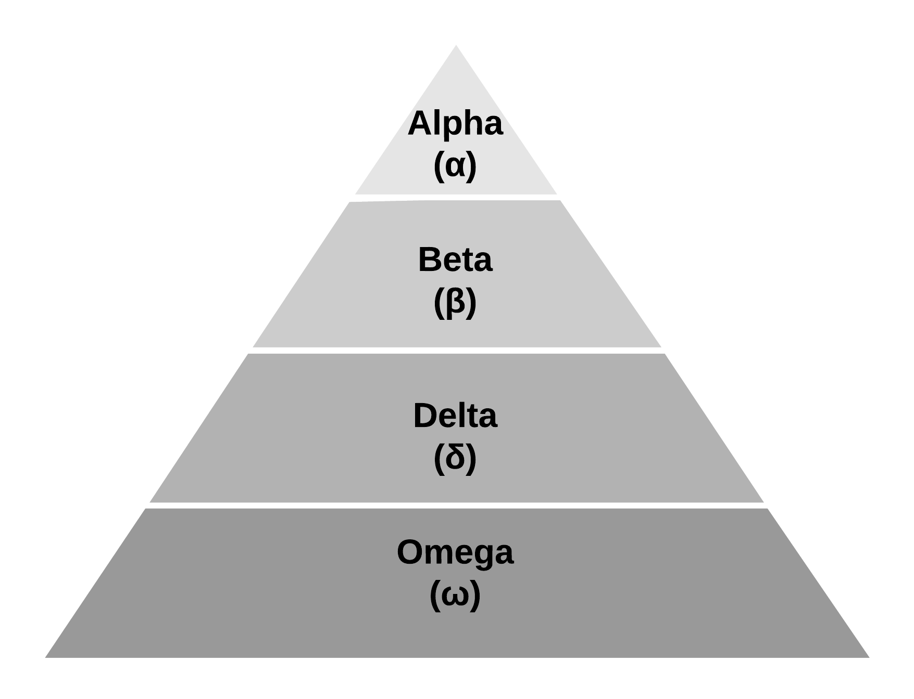
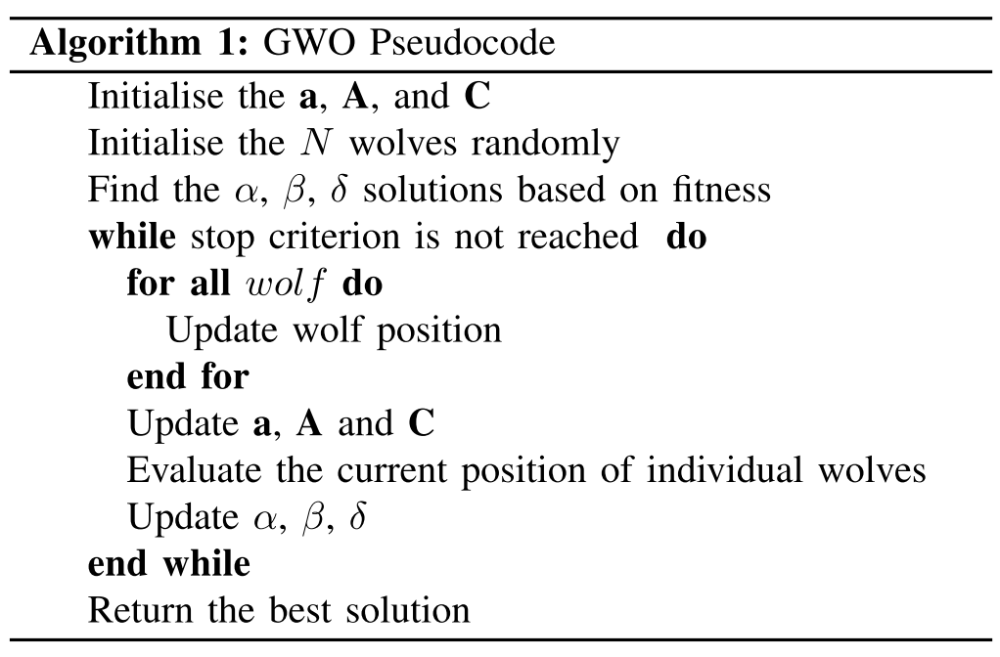

In nature, grey wolves live in a pack, and they organise themselves in a social hierarchy of four layers: alpha (α), beta (β), delta (δ) and omega (ω) as shown in Figure 1. The most dominant individual (leader) is the alpha, and it leads the pack. The second layer is the beta, it reinforces the commands of the alpha to the others, and it is an advisor of the alpha. Delta wolves are the scouts, sentinels, elders, hunters and caretakers. Delta wolves submit to alphas and betas, but they dominate the lowest level in the pack, the omegas. The grey wolves also hunt in a group. Hunting can be divided into three steps: (i) tracking, chasing and approaching the prey; (ii) pursuing encircling, and harassing the prey it stops moving; and (iii) attacking the prey.

 

Mirjalili et al. [10] proposed the Grey Wolf Optimizer (Algorithm 1) inspired by the social hierarchy and group hunting of wolves. Each wolf (i.e. the agent) represents a candidate solution in the proposal, and the social hierarchy is based on the current fitness value. The fittest wolf in the swarm is labelled as alpha. The second and third best solutions are labelled as beta and delta, respectively. They influence the movement of the rest of the swarm that is assumed to be the omega. The movement of the wolves is modelled to reproduce the group hunting. The encircled behaviour is proposed using Equation 1 and Equation 2.


(1)
$$
    \textbf{D} = | \textbf{C} \cdot \textbf{x}_{p}(i) - \textbf{x}(i)|               
$$



(2)
$$
    \textbf{x}(i+1) = \textbf{x}_{p}(i) - \textbf{A} \cdot \textbf{D},
$$


where x(i) and xp(i) are the wolf position, and the position of the prey in the iteration i, respectively. A and C are the coefficients that are calculated as follows


(3)
$$
    \textbf{A} = 2\textbf{a} \cdot \textbf{r}_1 - \textbf{a},

$$



(4)
$$
  \textbf{C} = 2 \cdot \textbf{r}_2,
$$


where r1, and r2, are random vectors generated in [0, 1]; a is a vector that the components are decreased linearly over iteration. As α, β and δ are the wolves nearest to the prey (i.e., best position), they are assumed as the prey position ( x_p). Thus, the movement is performed using Equations 5 and 6 considering α as the example, but it is also computed for β and δ.


(5)
$$
  \textbf{D}_{\alpha}  = | \textbf{C}_\alpha \cdot \textbf{x}_\alpha - \textbf{x} |
$$



(6)
$$
        \textbf{x'}_{\alpha}  = \textbf{x}_\alpha - \textbf{A}_1 \cdot \textbf{D}_{\alpha},
$$


Finally, the wolf new position is the mean of x’α, x’β, and x’δ, as described in Equation 7.


(7)
$$
    \textbf{x}(i+1)  = \frac{\textbf{x'}_{\alpha} + \textbf{x'}_{\beta} + \textbf{x'}_{\delta}}{3}.
$$


## Pseudocode

## Python Code

### Agent


### Benchmark Function


### Grey Wolf Optimizer Code


### Main code


Single file available here [https://github.com/rodrigoclira/gwo_nutshell](https://github.com/rodrigoclira/gwo_nutshell)

*Text from our paper '**Modelling the Social Interactions in Grey Wolf Optimizer**' available in [https://ieeexplore.ieee.org/document/9769781/](https://ieeexplore.ieee.org/document/9769781)*
