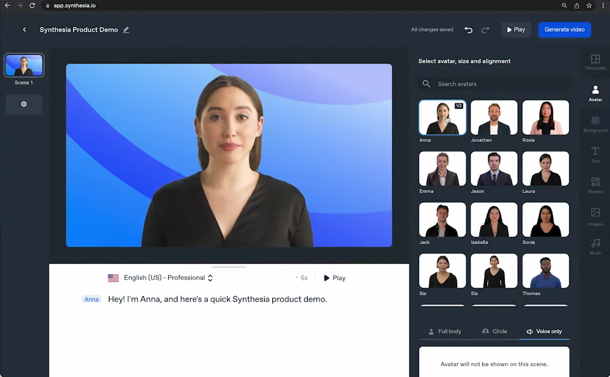
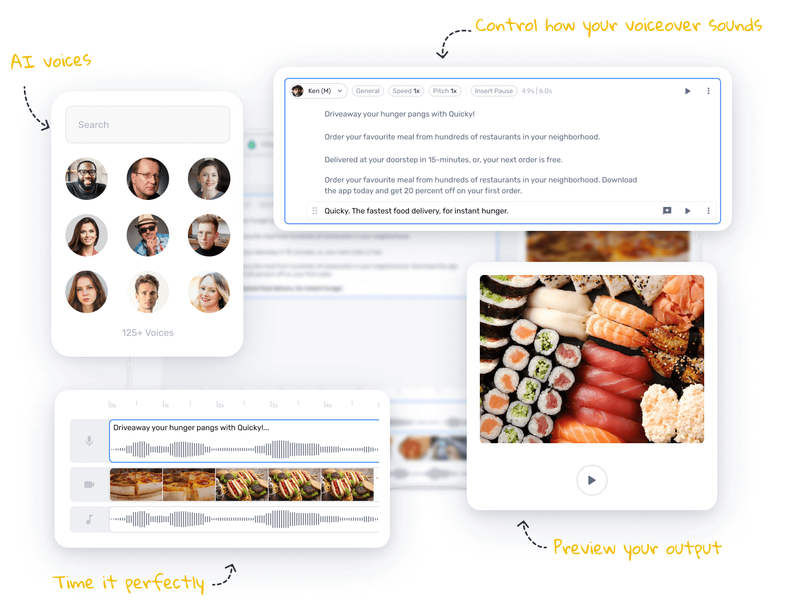
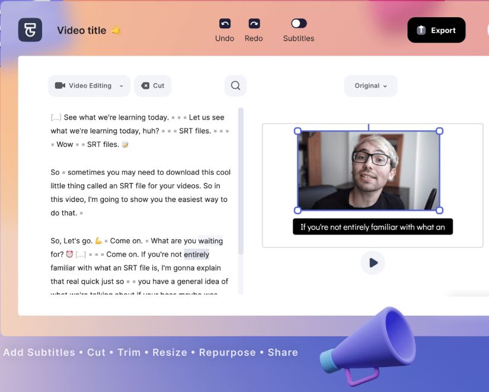
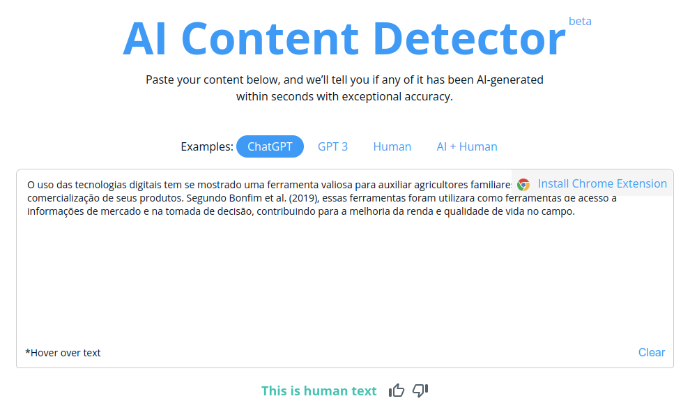
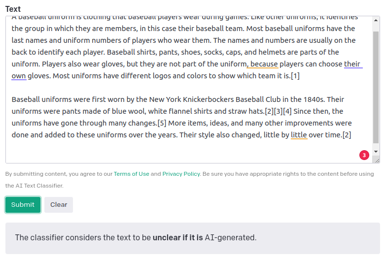
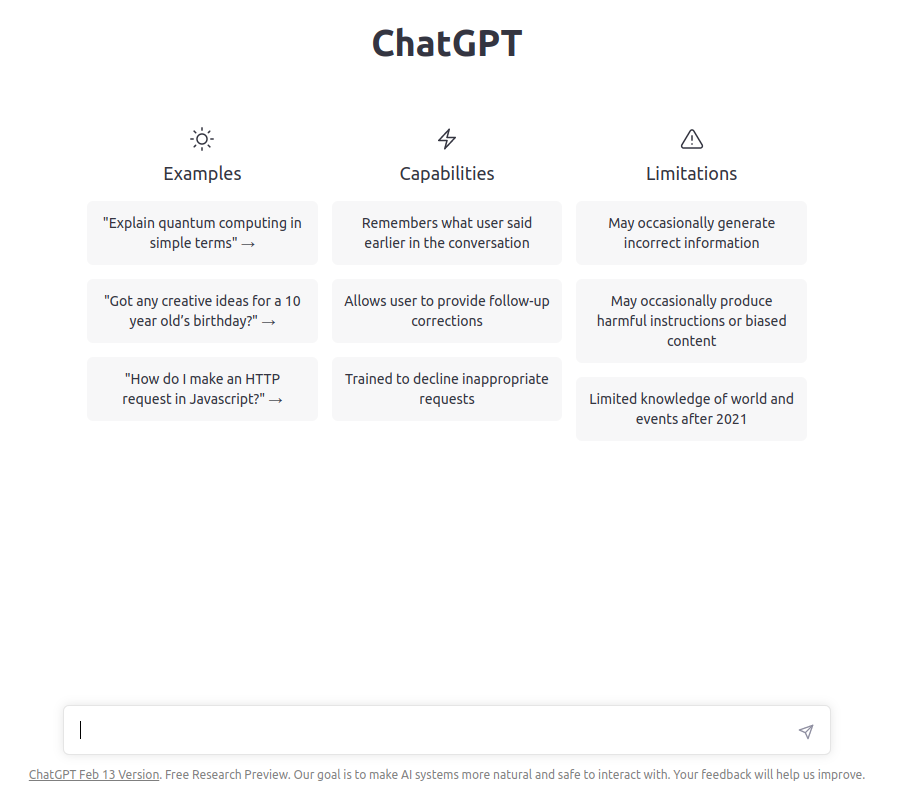
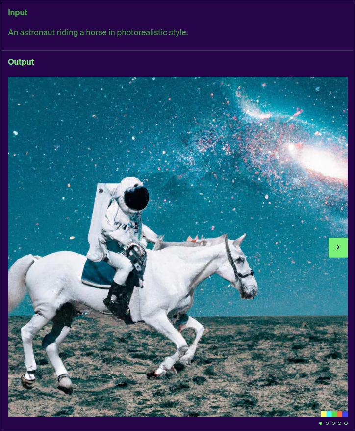

A Super Interessante trouxe uma matéria intitulada: "[O Futuro da IA](https://super.abril.com.br/tecnologia/o-futuro-da-inteligencia-artificial-e-o-que-vem-depois-do-chatgpt/)" no qual é apresentada a evolução dos projetos de IA. É uma matéria que detalha os projetos que vieram antes do ChatGPT e o que podemos esperar para o futuro. Em um dos infográficos foram apresentados projetos de IA que estão acessíveis (alguns pagos) para o usuário final, assim como o chatbot da OpenAI. 

Resolvi pegar essa listagem para começar um repositório de projeto desse tipo que podem ser utilizados no nosso dia a dia. 

## 1. Synthesia 

**Acesso**: Pago

**Link**: [http://synthesia.io](http://synthesia.io)

**O que é?** Ferramenta para geração de vídeo com informações escritas pelo usuário. O avatar narra o texto que foi criado pelo usuário. 

------- 

## 2. Murf

**Link**: [http://murf.ai](http://murf.ai)

**Acesso**: Pago (com nível gratuito)

**O que é?** O Murf é uma empresa que possui várias soluções ligadas a síntese de voz. No site é possível mudar ou clonar a voz contida em um áudio, além de gerar uma narração a partir de um texto. 

------- 

## 3. Runway

<video width=100% controls autoplay>
    <source src="rw-hero-magic-tools.mp4" type="video/mp4">
    Your browser does not support the video tag.  
</video>

**Acesso**: Pago (com nível gratuito)

**Link**: [http://runwayml.com](http://runwayml.com)

**O que é?** É um software para edição de imagem com funcionalidades geradas através de *machine learning*. Como ele é possível trocar/apagar objetos na imagem, separar as cenas e ampliar o cenário. 

------- 

## 4. Typestudio

**Link**: [http://app.typestudio.co](http://app.typestudio.co)

**Acesso**: Pago (com nível gratuito)

**O que é?** Permite editar vídeos e podcasts como se fossem textos: você apaga e reagrupa as frases e ele remonta automaticamente a gravação, fazendo ajustes necessários para que soe natural. 

------- 

## 5. AI Content Detector

**Link**: [http://copyleaks.com/features/ai-content-detector](http://copyleaks.com/features/ai-content-detector)

**Acesso**: Pago (com nível gratuito)

**O que é?** Serviço on-line para detecção de plagiarismo e geração automática de texto. 

------- 

## 6. AI Text Classifier by OpenAI

**Link**: [http://copyleaks.com/features/ai-content-detector](http://copyleaks.com/features/ai-content-detector)

**Acesso**: Gratuito

**O que é?** Um serviço de detecção de geração automática de texto, diponibilizado pela OpenAI. 

------- 

## 7. ChatGPT

**Link**: [https://chat.openai.com/chat](https://chat.openai.com/chat)

**Acesso**: Gratuito

**O que é?** É o chatbot com inteligência artificial desenvolvido pela OpenAI. Você pode fazer perguntas sobre assuntos diversos que ele vai responder de acordo com o conhecimento adquirido em um conjunto de textos utilizados no seu treinamento.

------- 

## 8. DALL-E-2

**Link**: [https://labs.openai.com/](https://labs.openai.com/)

**Acesso**: Gratuito

**O que é?** Segundo o site da OpenAI, DALL-E 2 o pode criar imagens originais e realistas e arte a partir de uma descrição de texto. Pode combinar conceitos, atributos e estilos.

