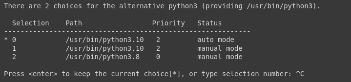

Desde que o Google atualizou a versão do Python no Colab para a versão 3.10, o mindspore não pode ser mais utilizado nesse ambiente. 
Até então não existe o suporte para a versão 3.10 e a instalação através do pip parou de funcionar. 
Para quebrar o meu projeto, eu resolvi fazer o *downgrade* da versão do Python. 

Segue o passo a passo. 
Execute o comando abaixo para descorbir os caminhos dos interpretadores já instalados. 

```
!update-alternatives --config python3
```



Talvez você tenha que cancelar a execução da célula para seguir para o próximo comando. 
Nesse caso vamos escolher o versão 3.8 para ser a padrão

```
!update-alternatives --set python3 /usr/bin/python3.8
```


Agora já pode checar a versão do Python
```
python --version
```

e voilà

```
!pip3 install mindspore
```


Caso você não encontre a instalação do pip, você pode instalá-lo com o comando abaixo: 

```
!curl https://bootstrap.pypa.io/get-pip.py -o get-pip.py
!python get-pip.py
```