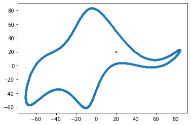

Acho que ouvi uma menção a essa história pela primeira vez quando estava lendo o [Deep Learning Book](http://deeplearningbook.com.br/), mas também pode ter sido em alguma aula do doutorado. Pesquisei um pouco e achei poucas informações sobre ela. Apesar de ter acontecido na década de 50, o conteúdo me parece muito atual. 

Em um [artigo de 2004 da Nature](https://doi.org/10.1038/427297a), o professor [Freeman Dyson](https://pt.wikipedia.org/wiki/Freeman_Dyson) descreveu o encontro que teve em 1953 com [Enrico Fermi](https://pt.wikipedia.org/wiki/Enrico_Fermi), que na época já era vencedor de um [prêmio nobel](https://www.nobelprize.org/prizes/physics/1938/fermi/facts/). 

O texto do artigo é muito interessante e vale a pena ser lido, porém o que interessa para o post é o diálogo final. Segundo descreve no artigo, em um momento do encontro, já desesperado pelo que tinha ouvido, Dyson questionou se Fermi não estava impressionado com os resultados numéricos da pesquisa que acabara de apresentá-lo. Nesse momento, Fermi perguntou o seguinte: "*Quantos parâmetros arbitrários você usou para seus cálculos?*". Após pensar, Dyson informou: "*Quatro*" e então Femi disse o seguinte: **"*Lembro que meu amigo Johnny von Neumann costumava dizer que com quatro parâmetros eu posso ajustar um elefante, e com cinco, posso fazê-lo mexer sua tromba*"**.

Até pode ser que von Neumann nunca tenha realmente dito isso, mas o professor Fermi estava certo quando disse que seria possível ajustar um elefante com quatro parâmetros. Em 2010, Jürgen Mayer, Khaled Khairy e Jonathon Howard publicaram o artigo [Drawing an elephant with four complex parameters](https://doi.org/10.1119/1.3254017) na revista American Journal of Physics. No artigo foi apresentado quatro números complexos que representavam os parâmetros necessários para especificar a forma do elefante, além de um quinto parâmetro responsável pelo olho e pela movimentação da tromba do animal. 

Eles desenharam o elefante como um conjunto de pontos que poderiam ser obtidos a partir das expansão das séries abaixo: 

$x(t)=\sum_{k=0}^{\infty} (A_{k}^{x}cos(kt) + B_{k}^{x}sen(kt))$

$y(t)=\sum_{k=0}^{\infty} (A_{k}^{y}cos(kt) + B_{k}^{y}sen(kt))$

Em que $A_{k}^{x}$, $B_{k}^{x}$, $A_{k}^{y}$, $B_{k}^{y}$ são os coeficientes da expansão. Os números complexos definidos pelos autores foram os seguintes:

|      Parâmetro         | Parte Real          | Parte Imaginária         |
|------------------------|---------------------|--------------------------|
| $p_1 = 50 - 30i$       | $B^x_1 = 50$        | $B^y_1 = 50$             |
| $p_2 = 18 + 8i$        | $B^x_2 = 18$        | $B^y_2 = 8$              |
| $p_3 = 12 - 10i$       | $A^x_3 = 12$        | $B^y_3 = -10$            |
| $p_4 = -14-60i$        | $A^x_5 =-14$        | $A^y_1 = -60$            | 
| $p_5 = 40+20i$         | *wiggle coeff. = 40*| $x_{eye} = y_{eye} = 20$ |

O artigo é curto, ele possui apenas duas páginas que são dedicadas a explicar como seria possível desenhar o elefante. O resultado foi apresentado em figura e também em um [vídeo](https://aapt.scitation.org/doi/suppl/10.1119/1.3254017) que pode ser visto na animação abaixo.

Segundo o artigo, a movimentação da tromba do elefante é possível pois é utilizado a parte real de $p_5$ (*wiggle coefficient*) que representa onde a tromba do animal é ligada ao corpo. Quem tiver curiosidade pode executar o código em Python abaixo disponibilizado em [How to fit an elephant](https://www.johndcook.com/blog/2011/06/21/how-to-fit-an-elephant/).



O resultado da execução código será a seguinte figura:
 

Por fim, eu destaco um trecho do [Deep Leaning Book]((http://deeplearningbook.com.br/overfitting-e-regularizacao-parte-1/)) como reflexão sobre tudo isso.

> O ponto, claro, é que modelos com um grande número de parâmetros podem descrever uma variedade incrivelmente ampla de fenômenos. Mesmo que tal modelo esteja de acordo com os dados disponíveis, isso não o torna um bom modelo. Isso pode significar apenas que há liberdade suficiente no modelo que pode descrever quase qualquer conjunto de dados de tamanho determinado, sem capturar nenhuma percepção genuína do fenômeno em questão.

