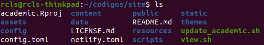
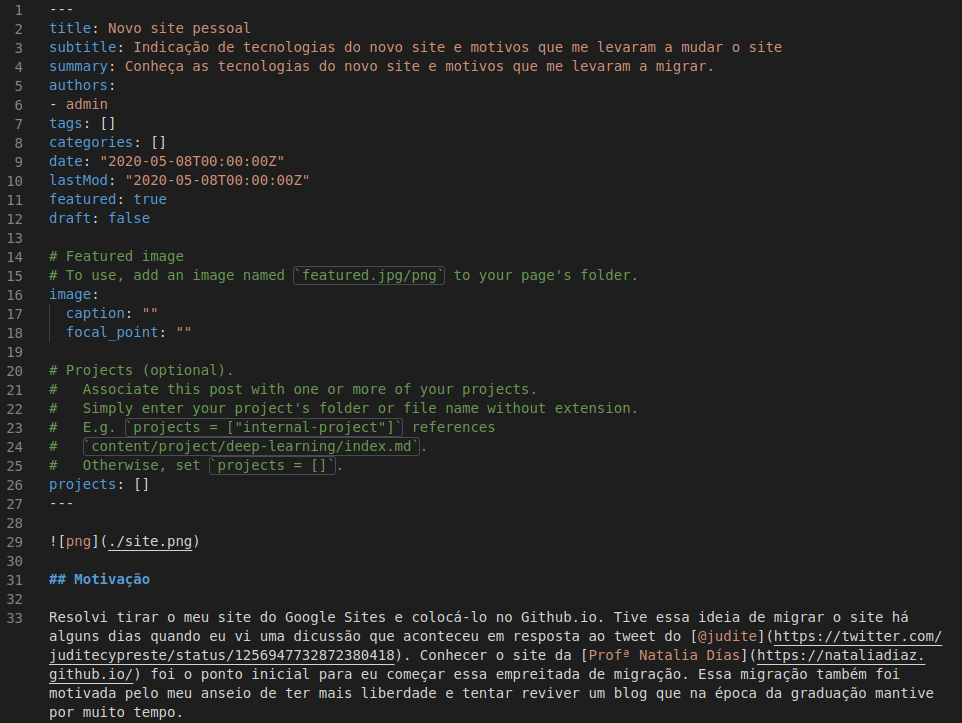

## Motivação

Resolvi tirar o meu site do Google Sites e colocá-lo no Github.io. Tive essa ideia de migrar o site há alguns dias quando eu vi uma dicussão que aconteceu em resposta ao tweet do [@judite](https://twitter.com/juditecypreste/status/1256947732872380418). Conhecer o site da [Profª Natalia Días](https://nataliadiaz.github.io/) foi o ponto inicial para eu começar essa empreitada de migração. Essa migração também foi motivada pelo meu anseio de ter mais liberdade e tentar reviver um blog que na época da graduação mantive por muito tempo.

## Tecnologias

Assim como o site da Profª Natalia, eu estou usando o gerador estático [Hugo](https://gohugo.io/getting-started/quick-start/) e o tema [Academic](https://sourcethemes.com/academic/docs/install/). No Academic, eu escolhi o padrão *forest* (branco/verde) pois é mais parecido com o padrão de cores utilizado pelo IFPE.

Na edição dos arquivos foi utilizado Vim e o VSCode (as extensões "markdonlint" e Markdown All in One estava habilitadas)

## Instalação e Configuração

A instalação e utilização deles é bem simples, eu segui basicamente os documentos dos *Quick Start* indicados em ambos os projetos. A configuração também foi bastante intuitiva, eu apenas tive que mudar algumas pequenas configurações nos arquivos de *markdown*. 

Eu não precisei ir muito a fundo da documentação, a leitura dos arquivos das pastas *config* e *content* esclarecem um pouco o funcionamento do  site. Eu também me baseei, como indicado na documentação do Academic, no site de exemplo que está disponível dentro da pasta do tema. A partir desse exemplo eu entendi como era o funcionamento de adição de novas postagens e projetos.

Abaixo segue a pasta principal do projeto do site.

Exemplo de arquivo de markdown.

