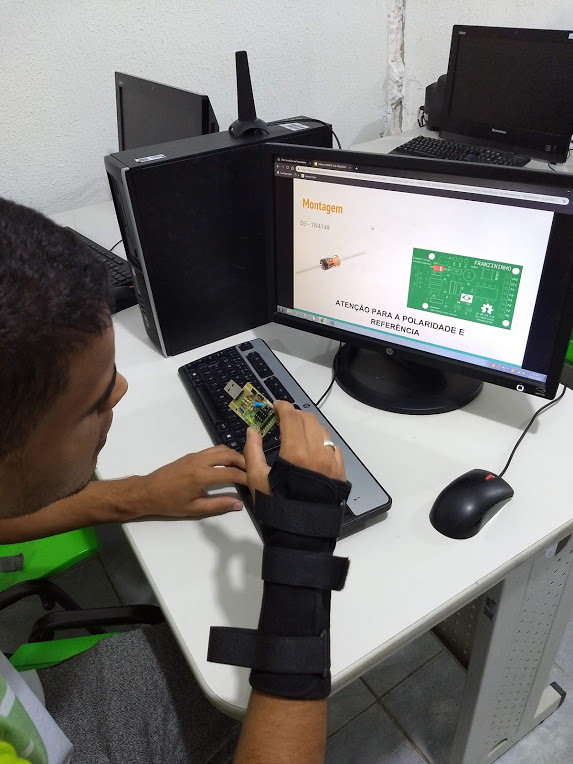
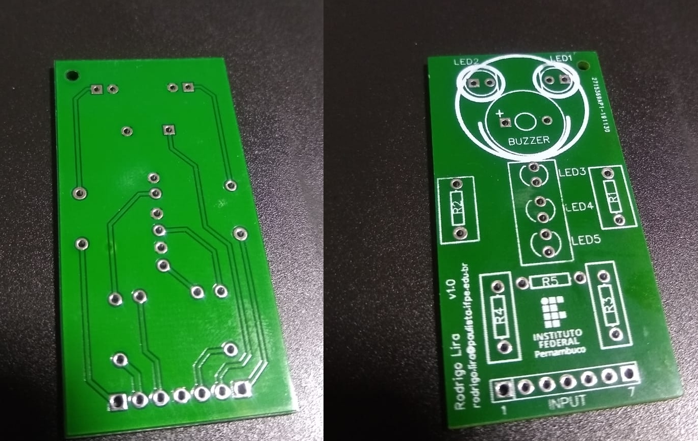

## Motivação

Desde 2018.2 ensino a disciplina de Prática Profissional Supervisionada no curso técnico de Manutenção e Suporte em Informática do IFPE Campus Paulista. Venho implementando, cada semestre com maior intensidade, a realização de atividades práticas que possam sejam úteis na formação dos alunos desse curso. Pela característica do curso, as atividades ficam muito relacionadas as áreas de redes de computadores, manutenção de computadores e eletrônica.

Uma atividade que sempre faço questão de realizar é a de remoção e soldagem de componentes eletrônicos. Já utilizei num passado a placa [Franzininho](https://franzininho.com.br/). Na ocasião precisei pedir para os alunos formarem grupos e comprarem os componentes pois eu só tinha as placas para doar. Lembro que apesar dos custos, eles aceitaram e se empolgaram bastante na realização da atividade de montagem da placa. Na imagem abaixo é possível ver uma foto de um dos alunos validando a soldagem dos componentes.

Nos semestres seguintes eu resolvi implementar a atividade de soldagem utilizando equipamentos quebrados pois as placas que tinham não dariam para realizar a atividade com muitos grupos. Para esse novo formato nós usamos fontes de computadores quebradas, mouses e rádios de pilhas. A atividade iniciava com a remoção dos componentes, utilizando um sugador, e em seguida os componentes eram soldados nos seus respectivos locais. Continuou sendo um momento muito bom para os estudantes porque trazia uma experiência que muitos ainda não tinham passado mas para mim ainda faltava algo. Por esse motivo eu resolvi continuar procurando alternativas... 

Até aquele momento não tinha passado na minha cabeça a criação uma placa, eu estava procurando por algum produto pronto que pudesse ser barato e fácil de adquirir. Nesse sentido eu encontrei alguns projetos, como o [Ligue o Fusca](https://www.newtoncbraga.com.br/index.php/kits/16573-ligue-o-fusca-uma-forma-de-ensinar-a-soldar-art4182), o [Badge aprenda a soldar](https://medium.com/franzininho/badge-aprenda-a-soldar-34b99ec2cb6f) e o [First Robot](https://www.gbkrobotics.com.br/boards). Esse último me chamou mais a atenção porque eu poderia usar a placa para fazer a iniciação a programação Arduino, outro assunto abordado na disciplina. 

Fui procurar pela placa em lojas na internet e achei pouca oferta. Até consegui adquirir um kit num [vendedor local](https://recicomp.com.br) mas era o único que ele tinha e também de uma versão com menos recursos. Sabendo disso, um amigo que trabalha com robótica educional me sugeriu construir uma placa similar e mandar confeccionar na China. Algo que a princípio eu achei desnecessário, mas que logo mudei de ideia.

## Projeto da Placa

Não era minha pretensão criar uma placa para esse próposito, mas eu fiquei um pouco desafiado a desenvolver o projeto. Por coincidência, eu tinha visto que um outro professor do IFPE tinha acabado de projetar uma placa para o seu projeto no [EasyEDA](https://easyeda.com). Depois de conversar com ele, ele me apresentou o seu projeto na plataforma e explicou rapidamente como poderia criar a placa em questão. 

Para me familiarizar no EasyEDA, eu resolvi comprar o curso [Circuito impresso: Criando uma Shield para Arduino](https://www.udemy.com/course/circuito-impresso-criando-uma-shield-para-arduino/) do Ricardo Teixeira. O curso ensina como utilizar a plataforma para desenvolver projetos, sendo o projeto final uma shield para Arduino Uno. Apesar de o EasyEDA ser intuitivo, o curso permitiu utilizar algumas funcionalidades que só quem já trabalhava nessa área poderia saber. 

A complexidade da placa facilitou bastante a minha vida. A placa projetada é bastante simples contendo apenas leds, buzzer e pinos para entrada dos sinais, componentes suficientes para realizar uma iniciação em Arduino. Acho que a parte mais complicada foi o posicionamento dos componentes e, consequentemente, o roteamento das trilhas. Confesso que não gastei muito tempo nesse projeto, acho que entre decidir criar e mandar confeccionar o projeto final das placas foram duas semanas. A versão no EasyEDA está apresentada na imagem abaixo.

## Confecção da Placa

Para mim a grande vantagem de usar o EasyEDA foi a sua integração com a JLCPCB, um fabricante de placas sediado em Hong Kong. Com poucos cliques foi possível enviar o projeto para ser manufaturado pela JLCPCB e escolher detalhes da placa como a cor, o tipo das pontas, dentre outras opções. O custo também foi bastante acessível, eu escolhi as opções mais baratas (padrão) de confecção e isso fez com que o custo total fosse de US$ 12 por 50 placas.

Acabei não dando sorte na entrega, os Correios perderam o pacote e me fizeram esperar um novo envio da JLCPCB. Não tive custos adicionais mais tive que contatar os Correios para devolverem a taxa de despacho postal (R$15) da encomenda extraviada. Recebi a placa nesse segundo envio, elas vieram bem lacradas num pacote embalado a vácuo. Na imagem abaixo é apresentada a foto de uma delas.

Ps.: Ainda não tive a oportunidade de utilizar a placa em aula, o atraso dos Correios levaram a entrega para o fim do semestre e o semestre atual foi suspenso pela pandemia.

